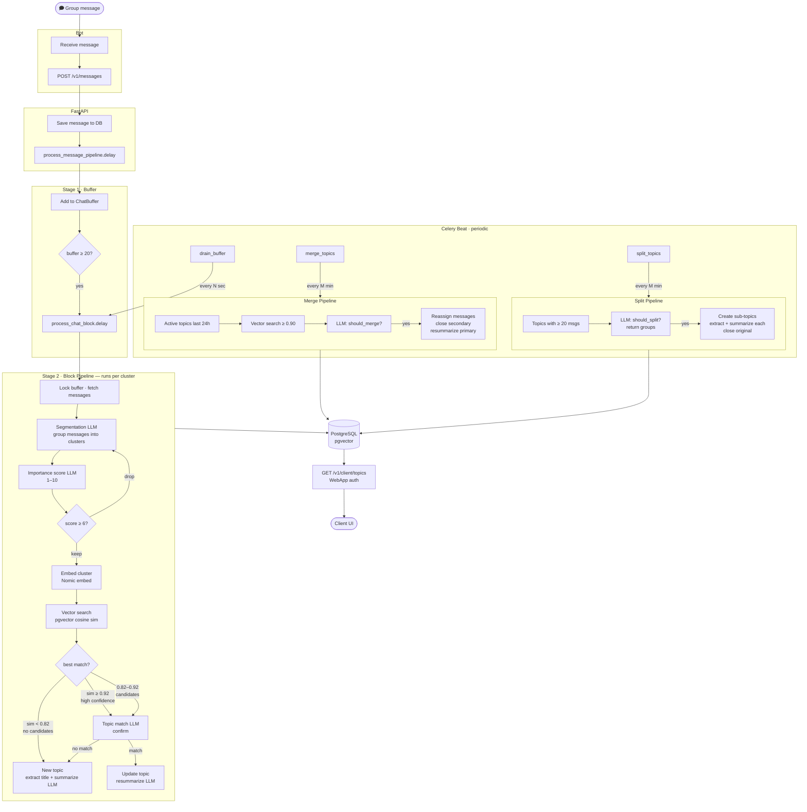

# Group Chat Summarization Bot


A self-hosted bot that reads your group chat, groups messages into topics, and keeps a running summary of each discussion — powered by a local LLM, no cloud required.

## Getting started

You'll need Docker, a running LLM server (any OpenAI-compatible API, e.g. [llama.cpp](https://github.com/ggml-org/llama.cpp)), an embedding server, and a bot token from [@BotFather](https://t.me/BotFather).

```bash
cp .env.example .env
# fill in BOT_TOKEN, LOCAL_LLM_MODEL, EMBEDDING_MODEL
docker compose up --build
docker compose exec backend alembic upgrade head
```

Add the bot to a group, grant it message read access — done.

## How it works

Messages are buffered per chat. Once the buffer fills, a pipeline runs: the LLM segments the batch into topic groups, scores each group for relevance (chatter and reactions get dropped), embeds the remainder, and matches against existing topics via vector similarity. Matched topics get their summaries updated; new topics are created. Background tasks periodically merge topics that converge and split ones that grow too broad.



## Configuration

All settings live in `.env`. The ones you'll actually touch:

| Variable | Description |
|---|---|
| `BOT_TOKEN` | Bot token from BotFather |
| `LOCAL_LLM_BASE_URL` | LLM server URL (OpenAI-compatible) |
| `LOCAL_LLM_MODEL` | Model name as served by the LLM server |
| `EMBEDDING_BASE_URL` | Embedding server URL |
| `EMBEDDING_MODEL` | Embedding model name |
| `TOPIC_MIN_IMPORTANCE` | Importance threshold (1–10) below which groups are dropped |
| `MATCH_CANDIDATE_THRESHOLD` | Cosine similarity for candidate topic lookup |
| `MATCH_HIGH_CONFIDENCE_THRESHOLD` | Cosine similarity for direct assignment (skips LLM confirmation) |

See `.env.example` for all values with defaults.

## Running tests

```bash
pip install pytest
PYTHONPATH=src pytest tests/ -v
```

## Tech

FastAPI · Celery + Redis · PostgreSQL + pgvector · aiogram 3 · Docker Compose
